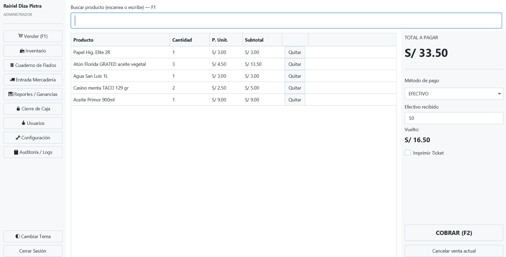
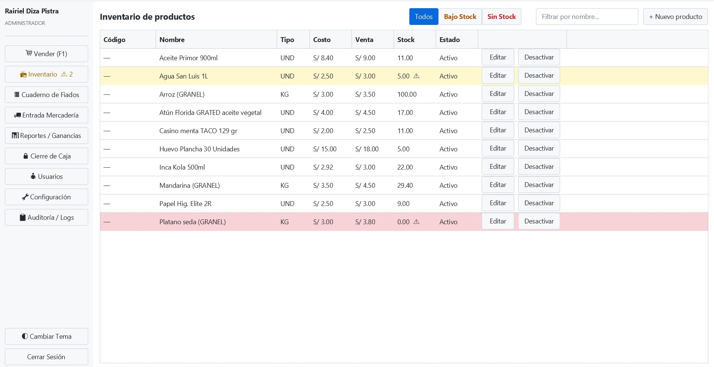
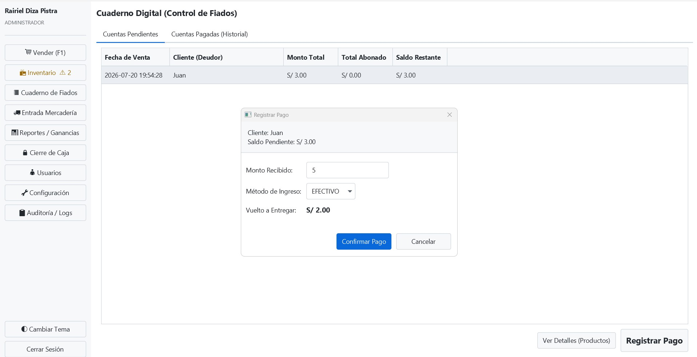
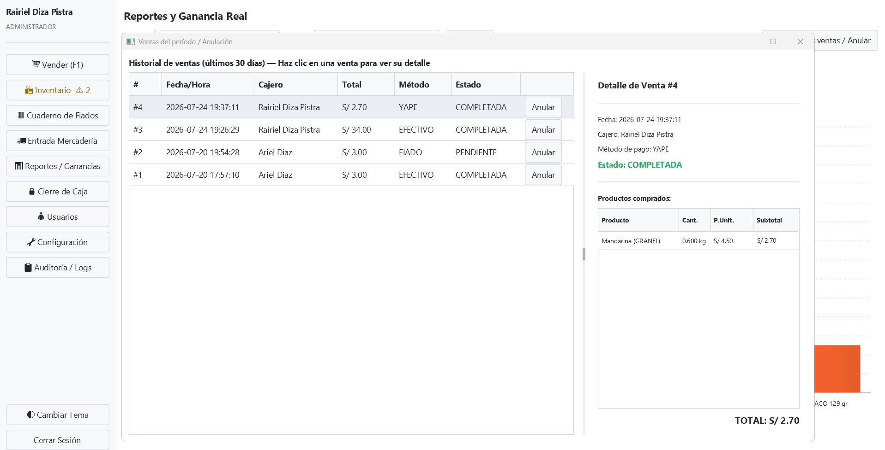
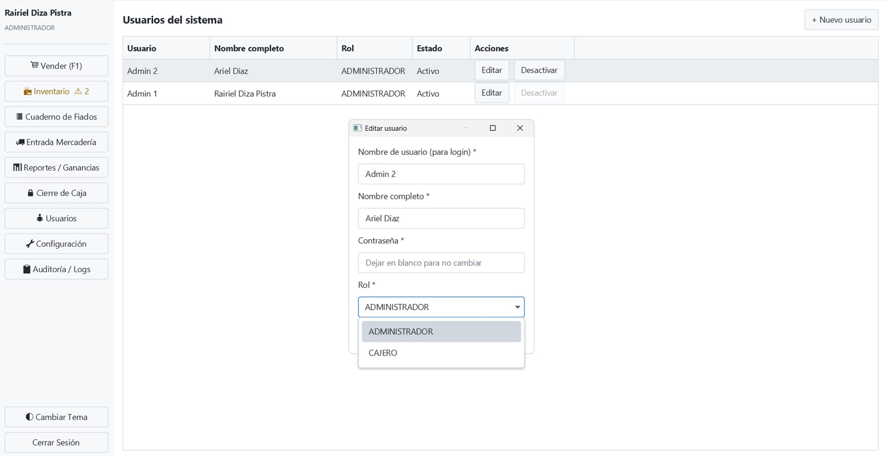
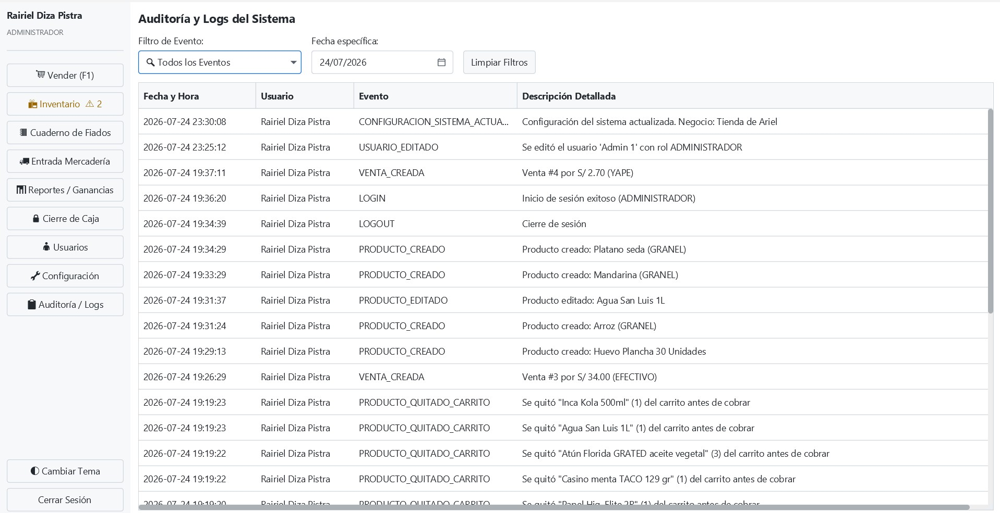

# 🛒 Sistema de Punto de Venta (POS) - Offline # 

Sistema de escritorio diseñado para bodegas, tiendas de abarrotes y negocios pequeños. Desarrollado con enfoque en rendimiento, fiabilidad sin conexión a internet y facilidad de uso.

> *** Este es un producto comercial cerrado. Este repositorio sirve como demostración técnica de la arquitectura, diseño de interfaz y capacidades del sistema para el portafolio del desarrollador. ***

## Características Principales ##
* **100% Offline:** Base de datos local embebida y encriptada, sin depender de la nube.
* **Gestión de Ventas:** Interfaz de caja registradora rápida, cálculos de vuelto, y soporte para anulación de ventas reponiendo stock automáticamente.
* **Inventario Seguro:** Cero eliminaciones de base de datos (soft-deletes) para mantener el histórico intacto. Costo histórico guardado en cada línea de venta.
* **Seguridad por Roles:** Niveles de acceso (Cajero vs Administrador).
* **Reportes y Auditoría:** Generación de tickets e historial de movimientos del sistema.

## Interfaz de Usuario ##

## Stack Tecnológico y Arquitectura ##
* **Lenguaje:** Java 17
* **Interfaz Gráfica:** JavaFX (con diseño moderno mediante CSS)
* **Base de Datos:** SQLite encriptado (SQLCipher) vía JDBC.
* **Reportes:** JasperReports (generación de tickets por código puro).
* **Arquitectura:** Modelo-Vista-Controlador (MVC) y Data Access Object (DAO) para separación de responsabilidades y transacciones ACID seguras.

-Desarrollado por [Zarcap]-
